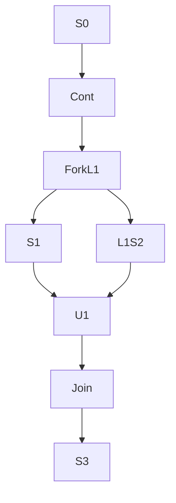
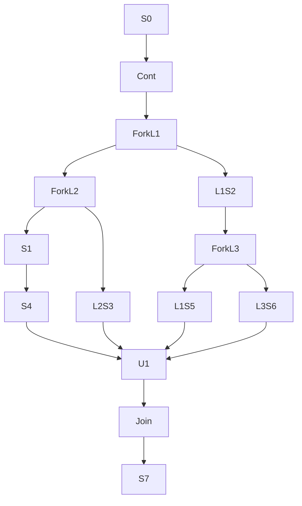
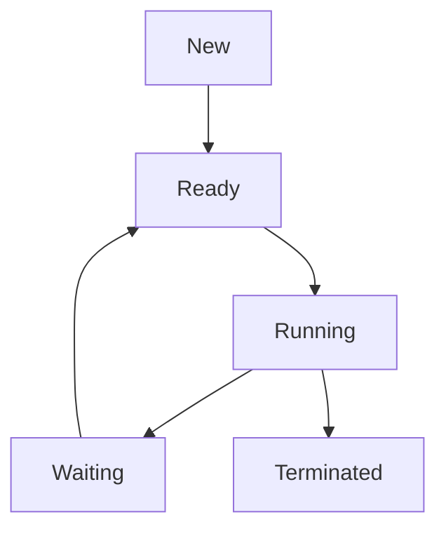

# ASO

## 📘 ¿Qué es una computadora según Von Neumann?  
John von Neumann definió una computadora como una máquina electrónica de propósito general, capaz de almacenar y ejecutar programas que manipulan datos.

## 🧠 Principios clave de su arquitectura:  

### Memoria única:  
- Almacena datos e instrucciones en el mismo lugar.  
- Permite modificar programas sin cambiar físicamente la máquina.  

### Unidad de procesamiento (CPU):  
- Formada por:  
  - **Unidad de Control**: Interpreta y dirige la ejecución de instrucciones.  
  - **Unidad Aritmético-Lógica (ALU)**: Realiza operaciones matemáticas y lógicas.  

### Ejecución secuencial:  
- Las instrucciones se ejecutan una por una, en orden, a menos que se indique lo contrario (como con bucles o saltos).  

### Dispositivos de Entrada/Salida:  
- Permiten la interacción con el mundo exterior (teclado, pantalla, impresora, etc.).  

## 🧩 Importancia del modelo:  
- Base del diseño de casi todas las computadoras modernas.  
- Introdujo el concepto de programa almacenado, esencial para la programación flexible.


# Componentes internos de la CPU

La CPU (Unidad Central de Procesamiento) es el "cerebro" del computador. Sus componentes internos principales son:

## Unidad de Control
- Se encarga de interpretar y secuenciar las instrucciones almacenadas en memoria.
- Dirige el flujo de datos y señales de control hacia los demás componentes (ALU, registros, E/S).

## Unidad Aritmético-Lógica (ALU)
- Realiza todas las operaciones de procesamiento de datos:
  - **Aritméticas**: suma, resta, multiplicación, división.
  - **Lógicas**: comparaciones, operaciones booleanas (AND, OR, NOT, XOR).
- Responde a las órdenes de la Unidad de Control.

## Registros
- Pequeñas celdas de memoria ultra-rápida dentro de la CPU.
- Almacenan temporalmente:
  - Datos en proceso de cálculo.
  - Direcciones de memoria.
  - Resultados intermedios.
- Mejoran la velocidad de ejecución al evitar accesos constantes a la memoria principal.

## Interconexiones (Bus interno)
- Conjunto de líneas eléctricas que comunican:
  - Unidad de Control ↔ ALU
  - ALU ↔ Registros
  - Registros ↔ Unidad de Control
- Permiten el transporte de datos, direcciones y señales de control de forma coordinada.


# Apunte Detallado: Arquitectura Von Neumann y Componentes Clave
# 1. Arquitectura Von Neumann
Concepto: Modelo de computación propuesto por John von Neumann donde datos e instrucciones comparten el mismo espacio de memoria.

Elementos principales:

Memoria (almacena datos e instrucciones).

CPU (procesa y controla la ejecución).

Dispositivos de Entrada/Salida (E/S).

Buses (canales de datos, direcciones y control).

# 2. Registros del Procesador
Definición: Pequeñas celdas de memoria ultra-rápida dentro de la CPU.

Tipos comunes:

Registro de instrucción (IR): Guarda la instrucción en ejecución.

Contador de programa (PC): Señala la dirección de la próxima instrucción.

Registro de estado (FLAGS): Indica condiciones (cero, acarreo, signo).

Registros generales: Operandos, resultados intermedios.

3. Ejecución de Instrucciones
Fetch (búsqueda)

La CPU lee la instrucción apuntada por el PC desde memoria.

Decode (decodificación)

La Unidad de Control interpreta la operación y sus operandos.

Execute (ejecución)

La ALU realiza la operación aritmético-lógica.

Write-back (escritura)

El resultado se escribe en un registro o en memoria.

Actualización de PC

El contador avanza a la siguiente instrucción o se modifica en saltos.

# 4. Interrupciones
Definición: Señales que suspenden la ejecución normal para atender eventos (E/S, errores, reloj).

Tipos:

Hardware: Pulsadores, temporizadores, controladores de E/S.

Software: Llamadas al sistema, excepciones.

Mecanismo:

Guarda contexto (registros, PC).

Salta a rutina de servicio de interrupción (ISR).

Atiende el evento.

Restaura contexto y reanuda la ejecución.

# 5. CPU (Unidad Central de Procesamiento)
5.1 Definición
Dispositivo encargado de interpretar y ejecutar las instrucciones de los programas, coordinando el funcionamiento del sistema.

# 5.2 Unidad de Control
Interpreta las instrucciones extraídas de la memoria.

Genera señales de control para direccionar el flujo de datos.

Coordina operaciones entre ALU, registros y E/S.

# 5.3 Unidad Aritmético-Lógica (ALU)
Operaciones aritméticas: suma, resta, multiplicación, división.

Operaciones lógicas: AND, OR, NOT, comparaciones.

Responde a las órdenes de la Unidad de Control.

6. Programas e Instrucciones
Programa: Secuencia de instrucciones que resuelven una tarea.

Instrucción: Operación elemental (leer, escribir, calcular, saltar).

Formato: Código de operación (opcode) + operandos.

Ciclo de vida: Compilación/ensamblado → carga en memoria → ejecución.

# 7. Memoria
7.1 Jerarquías de Memoria
Registros (más rápido, capacidad reducida)

Caché (L1, L2, L3)

Memoria principal (RAM)

Memorias secundarias (discos duros, SSD)

Almacenamiento fuera de línea (CD/DVD, cintas)

Dispositivos extraíbles (USB, tarjetas SD)

7.2 Memoria Principal (RAM)
Volátil: pierde datos al apagar.

Acceso aleatorio: lectura y escritura a igual velocidad.

Funciones: aloja programas e instrucciones en ejecución.

7.3 Memorias Secundarias
Discos duros (HDD): magnético, buena capacidad, menor velocidad.

Unidades de estado sólido (SSD): memoria flash, alta velocidad, coste mayor.

7.4 Almacenamiento Fuera de Línea
CD/DVD/Blu-Ray: óptico, uso para copias de respaldo o distribución.

Cintas magnéticas: alto volumen, lento acceso, archivado a largo plazo.

7.5 Dispositivos Extraíbles
USB flash drives: portátiles, pequeño tamaño, capacidad variable.

Tarjetas de memoria: SD, microSD; usadas en cámaras, móviles.


# 1. ¿Qué es una computadora?
Una computadora es un dispositivo electrónico que recibe datos, los procesa y entrega resultados. Ejecuta instrucciones mediante programas y realiza tareas de manera automática y precisa.

🔧 Componentes fundamentales:


# 2. ¿Qué es el CPU?
El CPU (Unidad Central de Procesamiento) es el “cerebro” de la computadora. Ejecuta instrucciones y controla el funcionamiento del sistema.

# 3. ¿Qué es la memoria principal?
Es la memoria RAM (Memoria de Acceso Aleatorio), donde se cargan temporalmente los datos y programas en ejecución.

🧠 Función:
Almacena instrucciones y datos para ser rápidamente accedidos por el CPU.

📌 Ejemplo:
Al abrir un programa, este se carga en la memoria RAM para su ejecución.

# 4. ¿Qué es la memoria secundaria?
Es un tipo de almacenamiento permanente y de gran capacidad como el disco duro o SSD.

🧠 Función:
Guardar datos y programas de manera persistente, incluso cuando el equipo se apaga.

📌 Ejemplo:
Archivos guardados en un disco duro (HDD).

# 5. ¿Qué es el almacenamiento fuera de línea?
Es el almacenamiento extraíble y no conectado permanentemente, como:

CD/DVD

USB

Discos externos

Usado para copias de seguridad, transporte de datos o almacenamiento temporal.

# 6. ¿Qué es una jerarquía de memorias?
Organización de memorias en niveles según:

Velocidad

Tamaño

Costo


# 7. ¿Qué es la memoria caché?
Es una memoria muy rápida ubicada cerca del CPU. Almacena instrucciones y datos usados con frecuencia, reduciendo el tiempo de acceso.

# 8. ¿Qué es un buffer?
Es una área de memoria temporal que almacena datos mientras se transfieren entre dispositivos con distintas velocidades.

📌 Ejemplo:
Reproducción de un video en streaming (el buffer almacena parte del video para evitar cortes).

# 9. ¿Qué es la memoria virtual?
Espacio de almacenamiento en disco que actúa como extensión de la RAM. Permite ejecutar más programas de los que la RAM podría manejar sola.

# 10. ¿Cuáles son los componentes fundamentales del CPU?
plaintext
Copiar
Editar


# 11. ¿Cuál es la función de la UC?
La Unidad de Control dirige el flujo de datos y coordina la ejecución de instrucciones, interpretando las órdenes del programa.

# 12. ¿Cuál es la función de la ALU?
La Unidad Aritmético-Lógica realiza operaciones matemáticas (suma, resta) y lógicas (AND, OR, NOT).

# 13. ¿Qué elemento de la UC indica la siguiente instrucción?
El contador de programa (PC, Program Counter) contiene la dirección de la siguiente instrucción a ejecutar.

# 14. ¿Qué es el ciclo de vida de una instrucción?
Es el proceso mediante el cual el CPU ejecuta instrucciones.

🔄 Fases del ciclo:
Búsqueda (Fetch): Se obtiene la instrucción de memoria.

Decodificación (Decode): Se interpreta la instrucción.

Ejecución (Execute): Se realiza la operación.

Almacenamiento (Write back): Se guardan resultados si es necesario.

# 15. ¿Qué son las técnicas de direccionamiento?
Métodos para acceder a los operandos que necesita una instrucción.

📌 Tipos:
Directo: La dirección del operando está en la instrucción.

Indirecto: La instrucción contiene una dirección que apunta a otra dirección donde está el operando.

Inmediato: El operando está directamente en la instrucción.

Por base y desplazamiento: Se suma un desplazamiento a un registro base.


# 16. ¿Qué son los periféricos?
Dispositivos que permiten la interacción con la computadora.

📎 Clasificación:
Entrada: Teclado, ratón

Salida: Monitor, impresora

Entrada/Salida: USB, disco externo

17. Mecanismos de E/S (Entrada/Salida)
✅ Guiado por programa:
El CPU controla todo el proceso de E/S. Es simple, pero ineficiente (CPU queda ocupada).

✅ Por interrupciones:
El dispositivo interrumpe al CPU cuando está listo, liberando al CPU mientras tanto.

✅ DMA (Acceso Directo a Memoria):
Un controlador especial transfiere datos entre la memoria y el dispositivo sin involucrar al CPU.


# -----------------------------------------------------------------------

# Esquema general de una computadora:


Unidad Central de Procesamiento (CPU): Es el cerebro de la máquina.

Unidad de Control (UC): Decodifica las instrucciones y genera las señales de control para coordinar las demás partes. Es crucial para implementar los modos de direccionamiento:
Direccionamiento Directo: La UC interpreta la dirección en la instrucción y la envía directamente al Registro de Dirección de Memoria (MAR).

Direccionamiento Indirecto: La UC interpreta la dirección en la instrucción, la envía al MAR para leer otra dirección de la memoria. Luego, usa esa segunda dirección (leyéndola a través del MBR y colocándola en el MAR) para acceder al operando final.

Direccionamiento Inmediato: La UC identifica que el operando está dentro de la propia instrucción (ya en el Registro de Instrucción) y lo pasa directamente a la ALU o a un registro, sin acceder a la memoria para buscarlo.

Unidad Aritmético-Lógica (ALU): Realiza operaciones matemáticas y lógicas sobre los datos.

Registros: Pequeñas unidades de memoria de alta velocidad dentro de la CPU.

Contador de Programa (PC): Almacena la dirección de la próxima instrucción a ejecutar.

Registro de Instrucción (IR): Almacena la instrucción que se está ejecutando actualmente. Contiene el código de operación y el campo de dirección/operando.

Registro de Dirección de Memoria (MAR): Almacena la dirección de memoria a la que se va a acceder (leer o escribir).

Registro de Buffer de Memoria (MBR) / Registro de Datos de Memoria (MDR): Almacena temporalmente los datos que se leen o escriben en la memoria.

Registros de Propósito General (GPRs): Usados para almacenar operandos y resultados intermedios (pueden incluir acumuladores, registros base, etc.).

Memoria Principal (RAM): Almacena instrucciones y datos. Es una secuencia de celdas, cada una con una dirección única.

Sistema de Entrada/Salida (E/S): Permite la comunicación con dispositivos externos (teclado, monitor, disco duro, etc.). 
Incluye controladores y puertos de E/S.

Buses del Sistema: Conjunto de cables que conectan los componentes principales.

Bus de Direcciones: Transporta las direcciones de memoria desde la CPU (MAR) a la memoria o a los dispositivos de E/S.
Bus de Datos: Transporta los datos entre la CPU (MBR), la memoria y los dispositivos de E/S.
Bus de Control: Transporta las señales de control desde la UC a los demás componentes (ej. señales de lectura/escritura de memoria, peticiones de interrupción).

# 2. Teniendo en cuenta que la memoria de la máquina del punto 1 tiene una cantidad de 1.048.576 palabras
¿Cuántos bits necesita para direccionarla?

2. Bits para direccionar 1.048.576 palabras
La cantidad de ubicaciones a direccionar es N = 1.048.576.
Necesitamos encontrar la cantidad de bits 'b' tal que 2^b ≥ N.
Calculamos el logaritmo en base 2: b = log₂(N).
Sabemos que 1.048.576 es exactamente 2^20 (ya que 1 Mebi = 2^20).
Entonces: b = log₂(2^20) = 20.
Respuesta: Se necesitan 20 bits para direccionar 1.048.576 palabras.

# 3. Si tiene una memoria de 8GiB ¿Cuántos bits necesita para direccionar la memoria? 

Bits para direccionar 8 GiB de memoria
Primero, convertimos GiB (Gibibytes) a bytes, asumiendo que la memoria es direccionable a nivel de byte (lo estándar).
1 GiB = 2^30 bytes.
8 GiB = 8 × 2^30 bytes = 2^3 × 2^30 = 2^33 bytes.
La cantidad de ubicaciones (bytes) a direccionar es N = 2^33.
Calculamos los bits necesarios: b = log₂(N) = log₂(2^33) = 33.
Respuesta: Se necesitan 33 bits para direccionar 8 GiB de memoria.

# 4. Suponga que la máquina tiene una memoria de 1GB con palabras de 64bits y el registro de instrucción del
CPU tiene 32bits, con su campo de direcciones de 16bits. Responda:
a. ¿Cuánta memoria se podría direccionar con direccionamiento directo?
b. ¿Cuánta memoria se podría direccionar con direccionamiento indirecto?
c. ¿Cuánta memoria se podría direccionar con direccionamiento inmediato?
d. ¿Cuánta memoria se podría direccionar si posee direccionamiento por base y desplazamiento, con
registros base de 24bits?
e. ¿Qué tamaño debería tener el contador de programa si se quiere aprovechar toda la memoria
completa para instrucciones? 

# 4. Análisis de la Máquina Específica
Datos:

Memoria Total: 1 GB = 2^30 bytes

Tamaño de Palabra: 64 bits = 8 bytes

Registro de Instrucción (IR): 32 bits

Campo de Direcciones (en IR): 16 bits

Registro Base: 24 bits

a. ¿Cuánta memoria se podría direccionar con direccionamiento directo?
Con 16 bits en el campo de dirección, se pueden direccionar 2^16 ubicaciones distintas.
Esto equivale a 2^16 bytes = 65.536 bytes = 64 KiB.
Respuesta (a): Se pueden direccionar 64 KiB con direccionamiento directo.

b. ¿Cuánta memoria se podría direccionar con direccionamiento indirecto?
El campo de direcciones de 16 bits apunta a una ubicación de memoria que contiene una dirección de 30 bits (ya que 1 GB = 2^30 bytes).
La dirección final puede ser cualquiera dentro del rango de 2^30.
Respuesta (b): Se puede direccionar 1 GB con direccionamiento indirecto.

c. ¿Cuánta memoria se podría direccionar con direccionamiento inmediato?
El operando está dentro de la propia instrucción, no se accede a memoria para obtenerlo.
Respuesta (c): 0 bytes (o “No aplica”, ya que no direcciona memoria).

d. ¿Cuánta memoria se podría direccionar si posee direccionamiento por base y desplazamiento, con registros base de 24 bits?
El registro base de 24 bits permite apuntar hasta 2^24 bytes = 16 MiB.

El desplazamiento de 16 bits permite acceder a 2^16 bytes = 64 KiB.

Combinando ambos, se pueden generar distintas "ventanas" de 64 KiB dentro de todo el rango de 1 GB.

Cambiando el valor del registro base, es posible cubrir toda la memoria.
Respuesta (d): Se puede direccionar 1 GB con direccionamiento por base y desplazamiento.

e. ¿Qué tamaño debería tener el contador de programa si se quiere aprovechar toda la memoria completa para instrucciones?
Si las instrucciones están direccionadas a nivel de byte, se necesitan log₂(2^30) = 30 bits.

Si las instrucciones están alineadas a palabras de 64 bits (8 bytes), se direccionan 2^30 / 8 = 2^27 ubicaciones.
Entonces, log₂(2^27) = 27 bits.
Respuesta (e): El contador de programa debe tener 30 bits si direcciona a nivel de byte, o 27 bits si direcciona palabras de 8 bytes.

Ejercicio 1: Microcontrolador con Memoria Limitada

Imagina un microcontrolador simple con las siguientes características:

Memoria Total: 512 KiB (Kibibytes), direccionable a nivel de byte.
Tamaño de Palabra: 16 bits.
Registro de Instrucción (IR): 20 bits.
Campo de Direcciones (en IR): 10 bits.
Posee un conjunto de Registros de Propósito General (GPRs) de 16 bits cada uno.
Responde:

Contador de Programa (PC): ¿Cuántos bits necesita el PC para poder direccionar toda la memoria de instrucciones?
Direccionamiento Directo: ¿Cuánta memoria (en KiB) se podría direccionar utilizando el campo de 10 bits del IR para direccionamiento directo?
Direccionamiento Indirecto por Registro: Si una instrucción usa un GPR de 16 bits para contener la dirección de memoria del operando (ej. LOAD R1, (R2) donde R2 contiene la dirección), ¿cuánta memoria podría direccionar este modo?
Direccionamiento Inmediato: ¿Cuánta memoria se direcciona para obtener el operando en un modo inmediato?
Direccionamiento Indexado: Supón un modo de direccionamiento indexado donde la dirección efectiva se calcula sumando el contenido del campo de direcciones de 10 bits (considerado como un desplazamiento sin signo) al contenido de un GPR de 16 bits (registro índice). ¿Cuál es el rango máximo de memoria que podría teóricamente alcanzar este modo si el GPR puede cargarse con cualquier valor?
Ejercicio 2: Sistema con Espacio de Direccionamiento Virtual

# EJERCICIOS

Considera un sistema con las siguientes especificaciones:

Memoria Física Instalada: 16 GiB, direccionable a nivel de byte.
Tamaño de Palabra: 64 bits.
Arquitectura de Direcciones Virtuales: El sistema utiliza direcciones virtuales de 48 bits.
Registro de Instrucción (IR): 32 bits.
Campo de Direcciones (en IR): 18 bits.
Responde:

Bits para Direccionar Memoria Física: ¿Cuántos bits se necesitan para direccionar de forma única cada byte de la memoria física instalada?
Espacio de Direccionamiento Virtual: ¿Cuál es el tamaño total del espacio de direcciones virtuales que la CPU puede generar (en TiB o PiB)?
Direccionamiento Directo (en espacio virtual): Si el campo de 18 bits del IR se usa para direccionamiento directo dentro del espacio virtual, ¿cuánta memoria virtual (en KiB o MiB) puede direccionar directamente?
Direccionamiento por Base y Desplazamiento: El sistema tiene registros base de 48 bits. Si el campo de direcciones de 18 bits del IR se usa como un desplazamiento, ¿cuánta memoria virtual se podría direccionar con este modo?
Paginación: Si el sistema usa páginas de 4 KiB para mapear direcciones virtuales a físicas, ¿cuántos bits de la dirección virtual de 48 bits se usarían para el número de página virtual y cuántos para el desplazamiento dentro de la página?
Ejercicio 3: Máquina con Direccionamiento Segmentado y Palabra Ancha

Supón una arquitectura con estas características:

Memoria Total: 64 GiB, direccionable a nivel de byte.
Tamaño de Palabra: 32 bits.
Registro de Instrucción (IR): 40 bits.
Campo de Segmento (en IR): 8 bits. Este campo selecciona uno de 2 
8 registros de segmento.
Registros de Segmento: Cada registro de segmento contiene una dirección base de 30 bits.
Campo de Desplazamiento (en IR): 20 bits.
El direccionamiento principal es segmentado, donde la dirección efectiva se calcula: Dirección Efectiva = Contenido del Registro de Segmento (seleccionado por el campo de segmento) + Campo de Desplazamiento del IR.

# Responde:

# Bits del PC: ¿Cuántos bits necesitaría el PC para direccionar toda la memoria física si las instrucciones se almacenan en cualquier byte?
# Tamaño de un Segmento: ¿Cuál es el tamaño máximo de un único segmento (es decir, cuánta memoria es accesible con un valor fijo en un registro de segmento, variando solo el desplazamiento de 20 bits)? Exprésalo en MiB.
# Direccionamiento Total con Segmentación: ¿Cuál es la cantidad máxima de memoria que se podría direccionar teóricamente con este esquema de segmentación (considerando que los registros de segmento pueden apuntar a cualquier base permitida por sus 30 bits y el desplazamiento se suma)?
# Direccionamiento Relativo al PC: Supón que existe un modo de direccionamiento relativo al PC. El campo de desplazamiento de 20 bits del IR se usa como un offset con signo (complemento a dos) que se suma al PC actual. ¿Cuál es el rango de direccionamiento (hacia adelante y hacia atrás) desde la instrucción actual, en MiB?
# Direccionamiento Indirecto: Si el resultado del cálculo de la dirección segmentada (Base de Segmento + Desplazamiento) apunta a una palabra de memoria (32 bits) que a su vez contiene una dirección física completa para acceder al operando final, ¿cuántos bits necesitaría esa dirección física completa almacenada en memoria?

Solución Ejercicio 1: Microcontrolador con Memoria Limitada
Memoria Total:
512 KiB = 512 × 1024 bytes = 2^9 × 2^10 bytes = 2^19 bytes.

Campo de Direcciones IR:
10 bits.

GPRs:
16 bits.

Contador de Programa (PC):
Para direccionar 2^19 bytes únicos, se necesita un PC con log₂(2^19) = 19 bits.
Respuesta: 19 bits.

Direccionamiento Directo:
El campo de direcciones de 10 bits puede especificar 2^10 direcciones diferentes.
Asumiendo direccionamiento a nivel de byte, esto corresponde a 2^10 bytes = 1024 bytes = 1 KiB.
Respuesta: 1 KiB.

Direccionamiento Indirecto por Registro:
El GPR de 16 bits contiene la dirección.
Con 16 bits se pueden generar 2^16 direcciones únicas = 65.536 bytes = 64 KiB.
Aunque la memoria total sea mayor, este modo está limitado por el tamaño del registro.
Respuesta: 64 KiB.

Direccionamiento Inmediato:
El operando está dentro de la instrucción. No se direcciona memoria para obtenerlo.
Respuesta: 0 bytes (No se direcciona memoria para el operando).

Direccionamiento Indexado:
EA (dirección efectiva) = GPR (16 bits) + Desplazamiento (10 bits).

GPR puede tener hasta 2^16 - 1 = 65.535.

Desplazamiento puede tener hasta 2^10 - 1 = 1023.
Dirección máxima generada: 65.535 + 1023 = 66.558.
Aunque esta suma exceda los 64 KiB, el alcance real está limitado por el tamaño del GPR.
Respuesta: El modo puede alcanzar hasta 66.558, pero en la práctica solo 64 KiB son direccionables consistentemente debido a los 16 bits del GPR.

Solución Ejercicio 2: Sistema con Espacio de Direccionamiento Virtual
Memoria Física:
16 GiB = 16 × 2^30 bytes = 2^4 × 2^30 bytes = 2^34 bytes.

Dirección Virtual:
48 bits.

Campo de Direcciones IR:
18 bits.

Tamaño de Página:
4 KiB = 4 × 1024 bytes = 2^12 bytes.

Bits para Direccionar Memoria Física:
log₂(2^34) = 34 bits.
Respuesta: 34 bits.

Espacio de Direccionamiento Virtual:
Con 48 bits, el espacio es de 2^48 bytes = 256 × 2^40 bytes = 256 TiB.
Respuesta: 256 TiB.

Direccionamiento Directo (en espacio virtual):
Campo de 18 bits → 2^18 bytes = 256 × 1024 bytes = 256 KiB.
Respuesta: 256 KiB.

Direccionamiento por Base y Desplazamiento:

Registro base de 48 bits puede apuntar a cualquier dirección dentro del espacio virtual.

Desplazamiento de 18 bits se suma a la base.
Respuesta: 256 TiB (todo el espacio virtual puede ser direccionado).

Paginación:

Dirección virtual: 48 bits.

Tamaño de página: 2^12 bytes.

Bits de desplazamiento: log₂(2^12) = 12 bits.

Bits del número de página virtual: 48 - 12 = 36 bits.
Respuesta: 36 bits para el número de página virtual y 12 bits para el desplazamiento.

Solución Ejercicio 3: Máquina con Direccionamiento Segmentado y Palabra Ancha
Memoria Física:
64 GiB = 64 × 2^30 bytes = 2^6 × 2^30 = 2^36 bytes.

Registros de Segmento:
Base de 30 bits.

Campo de Desplazamiento IR:
20 bits.

Dirección Efectiva (EA):
Base de segmento (30 bits) + desplazamiento (20 bits).

Bits del PC:
Para direccionar 2^36 bytes, se necesitan log₂(2^36) = 36 bits.
Respuesta: 36 bits.

Tamaño de un Segmento:
2^20 direcciones posibles con el desplazamiento → 2^20 bytes = 1 MiB.
Respuesta: 1 MiB.

Direccionamiento Total con Segmentación:

Dirección máxima: (2^30 - 1) + (2^20 - 1) ≈ 2^30 + 2^20

Eso es aproximadamente 1 GiB + 1 MiB.

Mucho menor que los 64 GiB disponibles, por lo tanto no se puede acceder a toda la memoria física.
Respuesta: Aproximadamente 1 GiB + 1 MiB.

Direccionamiento Relativo al PC:

Desplazamiento de 20 bits con signo → rango: desde -2^19 hasta +2^19 - 1

2^19 bytes = 512 KiB

Rango efectivo: desde PC - 512 KiB hasta PC + 511.999 KiB
Respuesta: Rango relativo de 1 MiB (desde -512 KiB hasta +511.999 KiB).

Direccionamiento Indirecto:

La dirección generada por segmentación apunta a una palabra de 32 bits.

Pero para cubrir toda la memoria física de 2^36 bytes se necesitarían 36 bits.

Limitación: No caben 36 bits en una palabra de 32 bits.
Respuesta: Se necesitan 36 bits, pero no pueden almacenarse en una palabra de 32 bits — hay una limitación real en este modo.

# CUESTIONARIO ARQUITECTURA

# Cuestionario Microprocesadores

# 1- ¿Qué es la ALU y para qué sirve?
La ALU (Arithmetic Logic Unit) o Unidad Aritmético-Lógica es un circuito digital fundamental dentro de la CPU (Unidad Central de Procesamiento).
Sirve para: Realizar operaciones aritméticas (como suma, resta, multiplicación, división) y operaciones lógicas (como AND, OR, NOT, XOR, comparaciones) sobre los datos (operandos) que recibe. Es el componente que ejecuta los cálculos y las decisiones lógicas básicas de la computadora.

# 2- ¿Qué es la Unidad de Control y para qué sirve?
La Unidad de Control (UC) es otro componente esencial de la CPU. Actúa como el "director de orquesta" del procesador.
Sirve para:

Buscar (Fetch): Obtener la siguiente instrucción a ejecutar desde la memoria principal.

Decodificar (Decode): Interpretar la instrucción para saber qué operación realizar y con qué datos.

Ejecutar (Execute): Generar y enviar las señales de control necesarias a las otras partes del computador (ALU, registros, memoria, periféricos) para que ejecuten la instrucción decodificada.

Coordinar: Sincronizar todas las actividades dentro de la CPU y entre la CPU y otros componentes del sistema.

# 3- Investigue qué son las arquitecturas RISC y CISC, indique cuáles son las ventajas y desventajas principales de cada una. Dé ejemplos de procesadores (dispositivos) que utilizan estas arquitecturas.

CISC (Complex Instruction Set Computer):
Características: Conjunto amplio y variado de instrucciones, muchas complejas. Formatos de instrucciones variables. Operaciones pueden acceder directamente a memoria.
Ventajas:

Menos instrucciones para realizar tareas complejas.

Código más compacto.

Más sencillo para programar en ensamblador.
Desventajas:

Hardware más complejo.

Tiempos de ejecución variables.

Difícil implementar pipelining.

Alto consumo energético.
Ejemplos: Intel x86/x86-64 (Core i3/i5/i7/i9), AMD Ryzen/EPYC.

RISC (Reduced Instruction Set Computer):
Características: Instrucciones simples, de formato fijo. Basada en registros. Arquitectura Load/Store.
Ventajas:

Hardware más simple y rápido.

Fácil implementar pipelining y ejecución paralela.

Menor consumo energético.

Rendimiento más predecible.
Desventajas:

Se requieren más instrucciones simples.

Dependencia de compiladores eficientes.
Ejemplos: ARM (Snapdragon, Apple M1/M2), RISC-V, MIPS, PowerPC.

Cuestionario Memoria

# 1- ¿Cuáles son los tipos de memoria que existen en informática?

Memoria Principal (Primaria):

RAM: Volátil. DRAM (común), SRAM (más rápida y cara).

ROM: No volátil. PROM, EPROM, EEPROM.

Memoria Flash: EEPROM rápida. Usada en SSDs, USB.

Memoria Caché: SRAM rápida entre CPU y RAM (L1, L2, L3).

Registros: Muy rápidos, dentro de la CPU.

Memoria Secundaria:

HDD, SSD (Flash), ópticos (CD/DVD), cintas.

Memoria Virtual: Parte del disco usada como RAM por el sistema operativo.

# 2- Organice las memorias encontradas en el punto anterior de manera jerárquica e indique cómo influye la misma en el costo de los diferentes dispositivos.

Jerarquía de Memoria (de mayor a menor velocidad):

Nivel 0: Registros → Muy rápida, muy costosa, poca capacidad.

Nivel 1: Caché (L1 < L2 < L3) → Muy rápida, cara, pequeña.

Nivel 2: RAM (DRAM) → Rápida, costo medio, capacidad media.

Nivel 3: Almacenamiento (SSD, HDD) → Lento, barato, gran capacidad.

Nivel 4: Almacenamiento terciario (ópticos, cintas) → Muy lento, muy barato, muy grande.

Influencia en el costo: Cuanto más rápida la memoria, más costosa por bit. Los dispositivos caros suelen tener más memoria rápida (más RAM, SSD, caché). Esto afecta directamente el rendimiento.

# 3- ¿Indique todas las unidades (tamaños) que puede tener una memoria, de menor a mayor?

Bit (b)

Byte (B) = 8 bits

Kibibyte (KiB) = 2¹⁰ bytes = 1,024 B

Mebibyte (MiB) = 2²⁰ bytes = 1,024 KiB

Gibibyte (GiB) = 2³⁰ bytes = 1,024 MiB

Tebibyte (TiB) = 2⁴⁰ bytes

Pebibyte (PiB) = 2⁵⁰ bytes

Exbibyte (EiB) = 2⁶⁰ bytes

(Nota: En almacenamiento, también se usan prefijos decimales: 1 KB = 1,000 B, 1 MB = 1,000,000 B, etc.).

# 4- ¿Qué es la volatilidad de la memoria? ¿A qué tipo de dispositivos afecta y a cuáles no?
La volatilidad indica si una memoria pierde su contenido al apagar el dispositivo.

Volátiles:

Registros

Caché

RAM (DRAM/SRAM)

No volátiles:

ROM, EEPROM

Flash (pendrives, SSD)

HDD, discos ópticos, cintas

Cuestionario Periféricos

# 1- ¿Qué es el control de E/S por interrupciones?
Es un método para que los periféricos avisen a la CPU cuando una operación de E/S ha finalizado.
Funcionamiento:

La CPU inicia una operación y sigue trabajando.

El dispositivo envía una interrupción cuando finaliza.

La CPU ejecuta una rutina específica (ISR) para atender el evento.

Luego retoma su tarea anterior.
Ventaja: La CPU no desperdicia tiempo revisando si el periférico terminó, mejora la eficiencia.

# 2- ¿Qué es DMA? ¿Cómo funciona?
DMA (Direct Memory Access) permite que ciertos dispositivos transfieran datos entre la memoria y el periférico sin intervención directa de la CPU.

Pasos:

La CPU configura al controlador DMA.

El DMA toma control del bus para transferir datos.

Al finalizar, envía una interrupción a la CPU.
Resultado: Transferencias más rápidas y la CPU queda libre para otras tareas.

# 3- ¿Cómo beneficia al rendimiento del sistema?

Libera a la CPU de tareas repetitivas de transferencia.

Aumenta la velocidad de transferencia (acceso directo).

Permite paralelismo: CPU trabaja mientras el DMA transfiere.

Mejora la eficiencia y rendimiento general del sistema.


# Unidad Temática II - Procesos

## Contenidos

---

### a) Procesos

#### Definición
Un **proceso** es un programa en ejecución. Incluye el código del programa, su estado actual (valores de los registros, contador de programa, etc.), pila y datos asociados.

#### Modelo de Procesos
Un proceso puede representarse mediante un **modelo de cinco estados**:
- **Nuevo:** El proceso está siendo creado.
- **Listo:** El proceso está esperando ser asignado al procesador.
- **Ejecución:** El proceso está usando la CPU.
- **Bloqueado (Espera):** El proceso espera un evento externo (como E/S).
- **Terminado:** El proceso ha finalizado su ejecución.

#### Jerarquía de Procesos
- Los sistemas operativos pueden organizar procesos en una jerarquía.
- **Proceso padre**: crea uno o más **procesos hijos**.
- Los procesos hijos pueden heredar recursos del padre.
- Se utilizan llamadas como `fork()`, `exec()` y `wait()` en sistemas tipo UNIX.

#### Implantación y Operación sobre Procesos
**Implantación:**  
- Requiere estructuras como el **PCB (Process Control Block)** que guarda información del proceso (estado, registros, identificador, etc.).

**Operaciones:**
- **Crear:** `fork()`, `CreateProcess()`
- **Ejecutar:** `exec()`, `start()`
- **Esperar:** `wait()`
- **Finalizar:** `exit()`, `kill()`

#### Procesos e Hilos
- **Proceso:** tiene su propio espacio de memoria y recursos.
- **Hilo (Thread):** unidad ligera de ejecución dentro de un proceso.
- Los hilos comparten espacio de direcciones, archivos abiertos, etc.
- Ventaja: menor costo de creación y cambio de contexto.

---

### b) Planificación de Procesos

#### Objetivo de la Planificación
Asignar el procesador entre los procesos listos de forma eficiente y justa.

#### Algoritmos de Planificación

##### FCFS (First Come, First Served)
- Los procesos se atienden en orden de llegada.
- **Ventajas:** simple, justo.
- **Desventajas:** tiempo de espera elevado para procesos cortos.

##### SJF (Shortest Job First)
- Elige el proceso con menor tiempo estimado de CPU.
- **Ventajas:** tiempo de espera promedio mínimo.
- **Desventajas:** puede provocar inanición.

##### Round-Robin
- Se asigna un **quantum** de tiempo a cada proceso en orden circular.
- **Ventajas:** buena respuesta para sistemas interactivos.
- **Desventajas:** depende del tamaño del quantum.

##### Por Prioridad
- Cada proceso tiene una prioridad; se ejecuta el de mayor prioridad.
- **Ventajas:** permite distinguir entre procesos críticos y no críticos.
- **Desventajas:** riesgo de inanición para prioridades bajas.

##### Colas Múltiples
- Varios niveles de colas según características (interactivo, por lotes, etc.).
- Cada cola puede tener su propio algoritmo.

##### Planificación de 2 Niveles
- Combinación de planificación a largo plazo (procesos nuevos) y a corto plazo (procesos listos para CPU).

#### Política vs. Mecanismo
- **Política:** qué se debe hacer (por ejemplo, elegir el proceso más corto).
- **Mecanismo:** cómo se implementa esa decisión.

---

### c) Comunicación entre Procesos

#### Procesos Concurrentes
- Son procesos que se ejecutan simultáneamente o de forma entrelazada.

#### Condiciones de Competencia (Race Conditions)
- Ocurren cuando múltiples procesos acceden y modifican datos compartidos de forma concurrente.

#### Secciones Críticas
- Parte del código donde se accede a recursos compartidos.

#### Exclusión Mutua con Espera Ocupada
- Estrategias como:
  - **Desactivación de interrupciones**
  - **Bandera de giro (spinlock)**
  - **Algoritmo de Peterson**

#### Dormir y Despertar
- Los procesos pueden suspenderse voluntariamente (sleep) y ser reanudados por otros procesos (wake).

#### Semáforos
- Variable entera utilizada para controlar el acceso a recursos compartidos.
- Operaciones atómicas:
  - `wait()` o `P()`
  - `signal()` o `V()`

#### Monitores
- Abstracción de alto nivel que encapsula variables, estructuras y funciones con exclusión mutua automática.

#### Transferencia de Mensajes
- Los procesos se comunican mediante el envío y recepción de mensajes.
- Puede ser **sincrónica** o **asincrónica**.
- Utilizada en sistemas distribuidos o sin memoria compartida.

---

## Objetivos Específicos

- Modelizar los Estados de un Proceso (Nuevo, Listo, Ejecutando, Espera, Terminado).
- Explicar funciones de los Planificadores y cómo impactan en los Estados del Proceso.
- Ejemplificar los Algoritmos de Planificación de CPU (FCFS, SJF, RR, Prioridad).
- Analizar **ventajas/desventajas** de cada algoritmo:
  - RR: Interactivo, pero sensible al quantum.
  - SJF: Óptimo en teoría, difícil de predecir.
- Evaluar la utilidad de **hilos** frente a procesos:
  - Menor sobrecarga, pero más complejos de sincronizar.
- Comparar algoritmos por:
  - **Eficiencia** (uso del CPU, rendimiento).
  - **Eficacia** (tiempo de respuesta, equidad).
- Ejemplificar la planificación en sistemas reales:
  - Linux: utiliza colas multinivel y prioridades.
  - Windows: planificación por prioridad con retroalimentación.
- Relacionar conceptos teóricos con implementaciones reales en sistemas operativos.


# Apunte: Procesos Concurrentes, Sincronización y Grafos de Precedencia

## 🔹 1. Procesos Secuenciales vs. Concurrentes

### Procesos Secuenciales

* Ejecutan una **secuencia de instrucciones** una tras otra en un solo procesador.
* Siempre producen los **mismos resultados** si se les dan los mismos datos.
* No requieren sincronización ni comunicación.

### Procesos Concurrentes

* Involucran **dos o más procesos/hilos** que pueden ejecutarse **simultáneamente o entrelazadamente**.
* Requieren **sincronización y comunicación** entre procesos.
* Pueden superponerse en el tiempo y aprovechar el paralelismo.

---

## 🔹 2. Conjuntos de Lectura y Escritura

### Notaciones:

* **R(Si)**: conjunto de lectura de la sentencia `Si` (variables leídas sin modificarse).
* **W(Si)**: conjunto de escritura de la sentencia `Si` (variables modificadas por `Si`).

### Ejemplo:

```text
S1: x = a + b       R(S1) = {a, b}       W(S1) = {x}
S2: y = c + b       R(S2) = {c, b}       W(S2) = {y}
S3: z = x + b       R(S3) = {x, b}       W(S3) = {z}
```

---

## 🔹 3. Condiciones de Bernstein (para concurrencia segura)

Dos instrucciones `Si` y `Sk` pueden ejecutarse **concurrentemente** si se cumple:

1. R(Si) ∩ W(Sk) = ∅
2. W(Si) ∩ R(Sk) = ∅
3. W(Si) ∩ W(Sk) = ∅

Estas condiciones aseguran que no hay conflictos de lectura/escritura.

### Ejemplo que permite concurrencia:

```text
S1: x = a + b       R(S1) = {a,b}, W(S1) = {x}
S2: y = c + b       R(S2) = {c,b}, W(S2) = {y}
Condiciones de Bernstein se cumplen ✔
```

### Ejemplo que NO permite concurrencia:

```text
S1: x = a + b       R(S1) = {a,b}, W(S1) = {x}
S3: z = x + b       R(S3) = {x,b}, W(S3) = {z}
W(S1) ∩ R(S3) = {x} → conflicto ❌
```

---

## 🔹 4. Grafo de Precedencia

Un **grafo dirigido sin ciclos** que representa la dependencia entre sentencias:

* **Nodos**: instrucciones o bloques.
* **Flechas**: dependen del orden de ejecución.

### Ejemplo:

```text
S1
 └──→ S2
 └─→ S3
 └─→ S4
S2, S3, S4 deben esperar que termine S1
S5 espera a que terminen S2, S3 y S4
```

### 🌟 Ventajas del uso de grafos:

* Permiten analizar **paralelismo potencial**.
* Mejoran la eficiencia en sistemas multiprocesador.

---

## 🔹 5. Expresiones Fork / Join

### Fork

* Divide el flujo en varios hilos.
* Cada hilo comienza en una etiqueta (`Fork L1;` ejecuta desde `L1:`).

### Join

* Espera a que varios hilos terminen antes de continuar.

### Ejemplo de código:

```text
S0;
Cont = 2;
Fork L1;
S1;
Goto U1;
L1: S2;
Goto U1;
U1: join Cont;
S3;
```

### Representación:



---

## 🔹 6. Expresiones Cobegin / Coend

Una forma de indicar que ciertas instrucciones pueden ejecutarse **en paralelo**.

### Sintaxis:

```text
S1;
Cobegin
  S2;
  S3;
Coend
S4;
```

* `S2` y `S3` se ejecutan en paralelo.
* `S4` espera a que ambas terminen.

---

## 🔹 7. Ejemplo con Fork/Join

### Código:

```text
S0;
Cont = 4;
Fork L1;
Fork L2;
S1;
S4;
Goto U1;
L1: S2;
Fork L3;
S5;
Goto U1;
L3: S6;
Goto U1;
L2: S3;
U1: join cont;
S7;
```

### Tareas concurrentes:

* **Hilo principal**: S1, S4
* **L1**: S2, S5 (crea L3)
* **L2**: S3
* **L3**: S6

### Grafo de Precedencia (Mermaid):



---

## 🔹 8. Conclusiones

* La **concurrencia** permite ejecutar tareas en paralelo pero requiere sincronización.
* Los **fork/join** y **cobegin/coend** son mecanismos para controlar hilos.
* Los **grafos de precedencia** ayudan a visualizar la ejecución concurrente y evitar errores.

# Guía de Actividades Nº 2 - Sistemas Operativos

## I - Cuestionario Guía de la Unidad 2

### 1. ¿Qué es un Sistema Operativo?

Es un software base que actúa como intermediario entre el hardware y el usuario. Gestiona los recursos del sistema (CPU, memoria, dispositivos de E/S) y proporciona una interfaz para que los programas se ejecuten.

### 2. Describa los diferentes tipos de arquitecturas de sistemas operativos que conoce con sus ventajas y desventajas.

* **Monolítico:** todo el sistema operativo corre en modo kernel.

  * *Ventaja:* rendimiento.
  * *Desventaja:* difícil de mantener.
* **Microkernel:** funcionalidades mínimas en el kernel, el resto en espacio de usuario.

  * *Ventaja:* estabilidad y seguridad.
  * *Desventaja:* rendimiento menor por mayor comunicación entre procesos.
* **Híbrido:** combina microkernel y monolítico (como Windows o Linux).

  * *Ventaja:* balance entre rendimiento y modularidad.
* **Cliente-servidor:** servicios como procesos separados que se comunican por mensajes.
* **Virtualizado:** permite ejecutar varios SO simultáneamente.

### 3. ¿Qué es el Kernel?

Es el núcleo del sistema operativo. Controla los recursos del sistema, la planificación de procesos, la gestión de memoria, y el acceso al hardware.

### 4. ¿Qué son los servicios?

Son funciones que el sistema operativo ofrece a las aplicaciones, como gestión de archivos, comunicación entre procesos, acceso a dispositivos, etc.

### 5. ¿Qué son los controladores (drivers)?

Programas que permiten que el sistema operativo interactúe con dispositivos de hardware (impresoras, discos, placas de red, etc.).

### 6. ¿Qué son las llamadas al sistema (system calls)?

Interfaces que permiten a los programas de usuario solicitar servicios al sistema operativo.

### 7. ¿Qué es un sistema multitarea (multitasking)?

Sistema que puede ejecutar varios procesos simultáneamente usando planificación de CPU.

### 8. ¿Qué es un sistema multiusuario?

Sistema que permite que varios usuarios usen los recursos del sistema al mismo tiempo.

### 9. ¿Qué es un sistema operativo de red y un sistema operativo distribuido?

* **SO de red:** permite compartir recursos entre computadoras conectadas a una red (ej: Windows Server).
* **SO distribuido:** coordina varios equipos para trabajar como un solo sistema unificado.

---

## II - Tareas de Laboratorio e Investigación (Linux)

### 1. ¿Qué es el kernel de Linux y qué es una distro? Mencione la versión de ambos.

* El **kernel** es el núcleo de Linux.
* Una **distro** es un sistema operativo completo basado en el kernel de Linux (ej: Ubuntu, Fedora).
* Para conocer versiones:

  ```bash
  uname -r     # versión del kernel
  lsb_release -a   # versión de la distribución
  ```

### 2. ¿Qué tipo de arquitectura tiene su sistema operativo?

Usar:

```bash
uname -m
```

Devuelve: x86\_64, armv7l, etc.

### 3. ¿Qué es la shell? ¿Qué Shell utiliza su distro?

* Es el interprete de comandos.
* Usar:

```bash
echo $SHELL
```

### 4. ¿Qué es la GUI?

Interfaz Gráfica de Usuario. Permite interacción visual con ventanas, iconos, etc.

### 5. ¿Por qué utilizaría el CLI si tiene la GUI?

* Mayor control
* Automatización (scripts)
* Eficiencia en tareas administrativas

### 6. ¿Qué es el usuario root?

El superusuario con todos los permisos del sistema. Puede modificar cualquier archivo o configuración.

### 7. ¿Cómo crear un nuevo usuario?

```bash
sudo adduser nombre_usuario
```

### 8. ¿Cómo cambiar la clave de un usuario?

```bash
sudo passwd nombre_usuario
```

### 9. ¿Qué es el gestor de paquetes? ¿Qué gestor tiene su distro?

* Sistema para instalar, actualizar y eliminar software.
* Ubuntu/Debian: `apt`
* Fedora: `dnf`
* Arch: `pacman`

### 10. ¿Para qué se usa el comando sudo?

Permite ejecutar comandos como superusuario (root).

### 11. ¿Cómo puede moverse entre directorios?

```bash
cd nombre_directorio
cd ..  # subir un nivel
```

### 12. ¿Cómo crear un directorio?

```bash
mkdir nombre_directorio
```

### 13. ¿Cómo listar los archivos y directorios contenidos en un directorio?

```bash
ls     # básico
ls -l  # detallado
```

### 14. ¿Cómo crear un archivo de texto?

```bash
touch archivo.txt
```

O editarlo con:

```bash
nano archivo.txt
```

### 15. ¿Cómo puedo solamente visualizar por pantalla un archivo de texto?

```bash
cat archivo.txt
less archivo.txt
```

### 16. ¿Qué alternativas tiene para poder crear y editar un archivo de texto con su sistema operativo?

* Editores CLI: `nano`, `vim`
* Editores GUI: `gedit`, `kate`, etc.

### 17. ¿Cómo se puede copiar un archivo de un directorio a otro?

```bash
cp archivo.txt /ruta/destino/
```

### 18. ¿Cómo se puede mover un archivo de un directorio a otro?

```bash
mv archivo.txt /ruta/destino/
```

# Guía de Actividades Nº 2 - Sistemas Operativos: Procesos

## I - Cuestionario Guía de la Unidad 2: Procesos

### 1. ¿Qué es un proceso?

Un proceso es un programa en ejecución, con su propio espacio de memoria, estado, y recursos asignados por el sistema operativo.

### 2. ¿Qué es un subproceso?

Un subproceso (o hilo/hilo de ejecución) es una unidad de ejecución dentro de un proceso, que comparte el mismo espacio de memoria y recursos.

### 3. ¿Para qué sirve el PCB? ¿Qué información lleva?

El **Process Control Block (PCB)** contiene toda la información del proceso: estado, contador de programa, registros, información de planificación, de memoria, de contabilidad y de E/S.

### 4. ¿Qué eventos básicos pueden llevar a la creación de un proceso?

* Iniciación del sistema
* Llamadas al sistema por parte de otro proceso (ej. `fork()`)
* Petición del usuario
* Inicio de un trabajo por lotes

### 5. ¿Cuáles son los estados básicos de un proceso? Grafíquelo.

* Nuevo (New)
* Listo (Ready)
* En ejecución (Running)
* Esperando (Waiting)
* Terminado (Terminated)



### 6. ¿Qué significa cada estado mencionado?

* **Nuevo:** el proceso está siendo creado.
* **Listo:** está preparado para ejecutarse.
* **Ejecución:** está usando el CPU.
* **Esperando:** espera un evento externo (E/S).
* **Terminado:** finalizó su ejecución.

### 7. ¿Cuál es la diferencia entre proceso e hilo (thread)?

Un hilo es una unidad de ejecución dentro de un proceso. Los procesos tienen espacio de direcciones separado; los hilos comparten el espacio y recursos.

### 8. ¿Por qué es importante la programación multihilo?

Mejora el rendimiento, permite tareas concurrentes, reduce el tiempo de respuesta y hace mejor uso del paralelismo.

### 9. ¿Qué es el CPU Scheduler?

Es el planificador de CPU que selecciona entre los procesos listos cuál se ejecutará a continuación.

### 10. ¿Cuál es la función del Dispatcher?

Cambia el contexto, cambia de modo, y transfiere el control al proceso seleccionado por el scheduler.

### 11. ¿Qué diferencia hay entre planificador a corto, mediano y largo plazo?

* **Corto plazo:** elige el siguiente proceso que usará la CPU.
* **Mediano plazo:** suspende o reactiva procesos.
* **Largo plazo:** decide qué procesos admitir al sistema.

### 12. Describa los siguientes algoritmos de planificación:

* **FCFS:** Primero en llegar, primero en ejecutarse.
* **Round Robin:** turnos de CPU con quantum fijo.
* **SPN:** el proceso con menor tiempo de ejecución estimado.
* **SRT:** el que tenga menos tiempo restante (preemptive).
* **HRRN:** mayor ratio de respuesta (espera + servicio) / servicio.
* **Feedback:** prioridad dinámica, baja si usa mucho CPU.

### 13. ¿Qué significa que la planificación sea "preemptive" o "non-preemptive"?

* **Preemptive:** puede interrumpir procesos.
* **Non-preemptive:** espera a que el proceso termine voluntariamente.

### 14. ¿Qué sucede si el quantum es demasiado pequeño en Round Robin?

Muchos cambios de contexto, menor eficiencia.

### 15. ¿Qué sucede si el quantum es demasiado grande?

Se pierde la sensación de interactividad, se asemeja a FCFS.

### 16. ¿Qué dificultad puede traer un algoritmo preemptive?

Mayor complejidad, riesgo de condiciones de carrera y sobrecarga de cambios de contexto.

### 17. ¿Por qué se organiza la planificación en colas?

Para separar procesos por tipo y prioridad, y aplicar políticas distintas a cada cola.

### 18. ¿Qué situaciones llevan a un deadlock?

* Exclusión mutua
* Retención y espera
* No expropiación
* Espera circular

### 19. ¿A qué se denomina Sección Crítica y qué problemas conlleva?

Es la parte del código donde un proceso accede a datos compartidos. Si no se controla, puede haber condiciones de carrera.

### 20. ¿Qué mecanismos existen para proteger la Sección Crítica?

* Desactivación de interrupciones
* Bloqueos (mutex)
* Semáforos
* Monitores
* Variables de condición

---

## II - Tareas de Laboratorio e Investigación (Linux)

### 1. ¿Cómo visualizar información sobre procesos?

```bash
ps aux
htop
```

### 2. ¿Qué datos se pueden extraer de un proceso?

* PID
* Usuario
* Estado
* CPU/memoria usada
* Tiempo de ejecución

### 3. ¿Cómo cambiar la prioridad de un proceso?

```bash
nice -n [valor] comando
renice -n [valor] -p PID
```

### 4. ¿Cómo forzar la finalización de un proceso?

```bash
kill PID
kill -9 PID
```

### 5. ¿Qué sistema de planificación usa su SO? Describa.

Linux usa un planificador **Completamente Justo (CFS)**, que reparte el tiempo de CPU de forma equitativa según prioridades.

### 6. ¿Cómo modificar el planificador de CPU?

* Se puede ajustar con `nice`, `cpuset`, o cambiar políticas con:

```bash
chrt -p [policy] PID
```

### 7. ¿Cómo maneja la Sección Crítica el sistema operativo?

Usa primitivas como **semáforos**, **mutex**, **spinlocks**, y soporte en kernel para evitar condiciones de carrera y asegurar exclusión mutua.

# Resolución de Ejercicio: Diagrama de Gantt, TRP y TEP


## Datos del problema

| Proceso | Tiempo de Arribo (A) | Tiempo de Ejecución (C) | Prioridad |
| ------- | -------------------- | ----------------------- | --------- |
| P1      | 0                    | 5                       | 1         |
| P2      | 4                    | 8                       | 0         |
| P3      | 7                    | 3                       | 2         |
| P4      | 9                    | 10                      | 3         |
| P5      | 10                   | 2                       | 0         |

**Fórmulas:**

* **TR (Tiempo de Respuesta / Finalización)** = Tiempo de finalización - Tiempo de llegada
* **TE (Tiempo de Espera)** = Tiempo de respuesta - Tiempo de ejecución

---

## a) FCFS (First Come, First Served)

Orden de ejecución según llegada: P1, P2, P3, P4, P5

### Diagrama de Gantt

```
Clock:    0 1 2 3 4 5 6 7 8 9 10 11 12 13 14 15 16 17 18 19 20 21 22 23 24 25 26 27 28
Proceso:  P1 P1 P1 P1 P1 P2 P2 P2 P2 P2 P2 P2 P2 P3 P3 P3 P4 P4 P4 P4 P4 P4 P4 P4 P4 P4 P5 P5
```

### Tiempos

| Proceso | Fin | TR = Fin - A | TE = TR - C |
| ------- | --- | ------------ | ----------- |
| P1      | 5   | 5            | 0           |
| P2      | 13  | 9            | 1           |
| P3      | 16  | 9            | 6           |
| P4      | 26  | 17           | 7           |
| P5      | 28  | 18           | 16          |

* **TRP** = (5 + 9 + 9 + 17 + 18) / 5 = **11.6**
* **TEP** = (0 + 1 + 6 + 7 + 16) / 5 = **6.0**

---

## b) Round Robin (Quantum = 3)

### Cola de procesos por llegada: P1 (0), P2 (4), P3 (7), P4 (9), P5 (10)

### Diagrama de Gantt (q=3)

```
Clock:    0 1 2 | 3 4 5 | 6 7 8 | 9 10 11 | 12 13 14 | 15 16 17 | 18 19 20 | 21 22 23 | 24 25 26 | 27 28
Proceso:  P1 P1 P1 P1 P1 P2 P2 P2 P3 P3 P3 P2 P2 P2 P4 P4 P4 P2 P2 P4 P4 P4 P4 P4 P4 P5 P5
```

### Tiempos de finalización (aproximados)

| Proceso | Fin | TR | TE = TR - C |
| ------- | --- | -- | ----------- |
| P1      | 5   | 5  | 0           |
| P2      | 17  | 13 | 5           |
| P3      | 11  | 4  | 1           |
| P4      | 25  | 16 | 6           |
| P5      | 27  | 17 | 15          |

* **TRP** = (5 + 13 + 4 + 16 + 17) / 5 = **11.0**
* **TEP** = (0 + 5 + 1 + 6 + 15) / 5 = **5.4**

### Quantum = 4 y Quantum = 6

(Estructura similar con menos cortes. Valores TRP y TEP mejoran para procesos largos pero empeoran para cortos.)

---

## c) SPN (Shortest Process Next)

Ejecuta el proceso con menor tiempo de CPU entre los disponibles.

### Orden estimada de ejecución: P1 (0), P3 (7), P5 (10), P2 (4), P4 (9)

### Diagrama de Gantt

```
Clock:    0 1 2 3 4 | 5 6 7 | 8 9 10 | 11 12 13 14 15 16 17 18 | 19 20 21 22 23 24 25 26 27 28
Proceso:  P1 P1 P1 P1 P1   P3 P3 P3   P5 P5     P2 P2 P2 P2 P2 P2 P2 P2   P4 P4 P4 P4 P4 P4 P4 P4 P4 P4
```

### Tiempos (aproximados)

| Proceso | Fin | TR | TE |
| ------- | --- | -- | -- |
| P1      | 5   | 5  | 0  |
| P3      | 8   | 1  | -2 |
| P5      | 10  | 0  | -2 |
| P2      | 18  | 14 | 6  |
| P4      | 28  | 19 | 9  |

* **TRP** = (5 + 1 + 0 + 14 + 19) / 5 = **7.8**
* **TEP** = (0 - 2 - 2 + 6 + 9) / 5 = **2.2**

---

## d) SRT (Shortest Remaining Time - Apropiativo)

### Ejecución con interrupciones según el proceso con menor tiempo restante

### Diagrama estimado

```
Clock:    0 1 2 3 4 | 5 6 7 | 8 9 | 10 11 12 13 14 15 16 17 18 | 19 20 21 22 23 24 25 26 27 28
Proceso:  P1 P1 P1 P1 P1   P3 P3 P3   P5 P5   P2 P2 P2 P2 P2 P2 P2 P2   P4 P4 P4 P4 P4 P4 P4 P4 P4 P4
```

| Proceso | Fin | TR | TE |
| ------- | --- | -- | -- |
| P1      | 5   | 5  | 0  |
| P3      | 8   | 1  | -2 |
| P5      | 10  | 0  | -2 |
| P2      | 18  | 14 | 6  |
| P4      | 28  | 19 | 9  |

* **TRP:** 7.8 (igual a SPN)
* **TEP:** 2.2 (igual a SPN)

---

## e) HRRN (Highest Response Ratio Next)

Calcula: (Espera + Servicio) / Servicio = (E + C)/C

### Orden probable según prioridad dinámica:

* P1, luego P3 (espera corta), luego P5 (ratio alto), luego P2, finalmente P4

### Tiempos (idénticos o similares a SPN)

* **TRP:** \~7.8
* **TEP:** \~2.2

---

**Conclusión:**

* **FCFS** es simple pero genera largas esperas a procesos cortos.
* **RR** mejora la respuesta para procesos cortos, depende del quantum.
* **SPN, SRT y HRRN** mejoran el tiempo medio, pero requieren conocimiento de duraciones.

🔄 Recomendado: implementar estos algoritmos con simulaciones para ver sus efectos en distintos escenarios.


# Resolución de Ejercicios de Planificación de Procesos

Este documento presenta la resolución de un problema de planificación de procesos utilizando diferentes algoritmos de CPU. Para cada algoritmo, se calculan el tiempo de finalización, el tiempo de retorno (Turnaround Time) y el tiempo de espera (Waiting Time) para cada proceso, así como los promedios de estos tiempos para el conjunto total de procesos.

**Información de los Procesos:**

| Proceso | Tiempo de Arribo (AT) | Tiempo de Ejecución (BT) | Prioridad |
|---|---|---|---|
| A | 0 | 3 | 1 |
| B | 2 | 6 | 0 |
| C | 4 | 4 | 2 |
| D | 6 | 5 | 2 |
| E | 8 | 2 | 0 |

---

### a) FCFS (First-Come, First-Served)

Los procesos se ejecutan en el orden en que llegan.

**Diagrama de Gantt (FCFS):**

Clock:   0  1  2  3  4  5  6  7  8  9 10 11 12 13 14 15 16 17 18 19 20

Proceso: A  A  A |B  B  B  B  B  B |C  C  C  C |D  D  D  D  D |E  E

**Cálculos Detallados:**

* **Proceso A:**
    * Tiempo de Inicio: 0
    * Tiempo de Finalización: 0 + 3 = 3
    * Tiempo de Retorno: 3 - 0 = 3
    * Tiempo de Espera: 3 - 3 = 0
* **Proceso B:**
    * Tiempo de Inicio: 3
    * Tiempo de Finalización: 3 + 6 = 9
    * Tiempo de Retorno: 9 - 2 = 7
    * Tiempo de Espera: 7 - 6 = 1
* **Proceso C:**
    * Tiempo de Inicio: 9
    * Tiempo de Finalización: 9 + 4 = 13
    * Tiempo de Retorno: 13 - 4 = 9
    * Tiempo de Espera: 9 - 4 = 5
* **Proceso D:**
    * Tiempo de Inicio: 13
    * Tiempo de Finalización: 13 + 5 = 18
    * Tiempo de Retorno: 18 - 6 = 12
    * Tiempo de Espera: 12 - 5 = 7
* **Proceso E:**
    * Tiempo de Inicio: 18
    * Tiempo de Finalización: 18 + 2 = 20
    * Tiempo de Retorno: 20 - 8 = 12
    * Tiempo de Espera: 12 - 2 = 10

**Resumen FCFS:**

| Proceso | Tiempo de Arribo | Tiempo de Ejecución | Tiempo de Finalización | Tiempo de Retorno | Tiempo de Espera |
|---|---|---|---|---|---|
| A | 0 | 3 | 3 | 3 | 0 |
| B | 2 | 6 | 9 | 7 | 1 |
| C | 4 | 4 | 13 | 9 | 5 |
| D | 6 | 5 | 18 | 12 | 7 |
| E | 8 | 2 | 20 | 12 | 10 |
| **Totales** | | | | **43** | **23** |

* **Tiempo de Retorno Promedio:** 43 / 5 = **8.6**
* **Tiempo de Espera Promedio:** 23 / 5 = **4.6**

---

### b) Round Robin (RR)

#### b.1) Round Robin con quantum q = 3

**Diagrama de Gantt (RR q=3):**

Clock:   0  1  2  3  4  5  6  7  8  9 10 11 12 13 14 15 16 17 18 19 20

Proceso: A  A  A |B  B  B |C  C  C |D  D  D |E  E |B  B  B |C  |D  D

**Cálculos:**

| Proceso | Tiempo de Arribo | Tiempo de Ejecución | Tiempo Restante | Tiempo de Finalización | Tiempo de Retorno | Tiempo de Espera |
|---|---|---|---|---|---|---|
| A | 0 | 3 | 0 | 3 | 3 - 0 = 3 | 3 - 3 = 0 |
| B | 2 | 6 | 0 | 17 | 17 - 2 = 15 | 15 - 6 = 9 |
| C | 4 | 4 | 0 | 18 | 18 - 4 = 14 | 14 - 4 = 10 |
| D | 6 | 5 | 0 | 20 | 20 - 6 = 14 | 14 - 5 = 9 |
| E | 8 | 2 | 0 | 14 | 14 - 8 = 6 | 6 - 2 = 4 |
| **Totales** | | | | | **52** | **32** |

* **Tiempo de Retorno Promedio:** 52 / 5 = **10.4**
* **Tiempo de Espera Promedio:** 32 / 5 = **6.4**

#### b.2) Round Robin con quantum q = 4

**Diagrama de Gantt (RR q=4):**

Clock:   0  1  2  3  4  5  6  7  8  9 10 11 12 13 14 15 16 17 18 19 20

Proceso: A  A  A |B  B  B  B |C  C  C  C |D  D  D  D |E  E |B  B |D

**Cálculos:**

| Proceso | Tiempo de Arribo | Tiempo de Ejecución | Tiempo Restante | Tiempo de Finalización | Tiempo de Retorno | Tiempo de Espera |
|---|---|---|---|---|---|---|
| A | 0 | 3 | 0 | 3 | 3 - 0 = 3 | 3 - 3 = 0 |
| B | 2 | 6 | 0 | 19 | 19 - 2 = 17 | 17 - 6 = 11 |
| C | 4 | 4 | 0 | 11 | 11 - 4 = 7 | 7 - 4 = 3 |
| D | 6 | 5 | 0 | 20 | 20 - 6 = 14 | 14 - 5 = 9 |
| E | 8 | 2 | 0 | 17 | 17 - 8 = 9 | 9 - 2 = 7 |
| **Totales** | | | | | **50** | **30** |

* **Tiempo de Retorno Promedio:** 50 / 5 = **10.0**
* **Tiempo de Espera Promedio:** 30 / 5 = **6.0**

#### b.3) Round Robin con quantum q = 6

**Diagrama de Gantt (RR q=6):**
Aquí tienes la resolución completa en formato Markdown, lista para copiar y pegar en un archivo README.md:

# Resolución de Ejercicios de Planificación de Procesos

Este documento presenta la resolución de un problema de planificación de procesos utilizando diferentes algoritmos de CPU. Para cada algoritmo, se calculan el tiempo de finalización, el tiempo de retorno (Turnaround Time) y el tiempo de espera (Waiting Time) para cada proceso, así como los promedios de estos tiempos para el conjunto total de procesos.

**Información de los Procesos:**

| Proceso | Tiempo de Arribo (AT) | Tiempo de Ejecución (BT) | Prioridad |
|---|---|---|---|
| A | 0 | 3 | 1 |
| B | 2 | 6 | 0 |
| C | 4 | 4 | 2 |
| D | 6 | 5 | 2 |
| E | 8 | 2 | 0 |

---

### a) FCFS (First-Come, First-Served)

Los procesos se ejecutan en el orden en que llegan.

**Diagrama de Gantt (FCFS):**


**Cálculos Detallados:**

* **Proceso A:**
    * Tiempo de Inicio: 0
    * Tiempo de Finalización: 0 + 3 = 3
    * Tiempo de Retorno: 3 - 0 = 3
    * Tiempo de Espera: 3 - 3 = 0
* **Proceso B:**
    * Tiempo de Inicio: 3
    * Tiempo de Finalización: 3 + 6 = 9
    * Tiempo de Retorno: 9 - 2 = 7
    * Tiempo de Espera: 7 - 6 = 1
* **Proceso C:**
    * Tiempo de Inicio: 9
    * Tiempo de Finalización: 9 + 4 = 13
    * Tiempo de Retorno: 13 - 4 = 9
    * Tiempo de Espera: 9 - 4 = 5
* **Proceso D:**
    * Tiempo de Inicio: 13
    * Tiempo de Finalización: 13 + 5 = 18
    * Tiempo de Retorno: 18 - 6 = 12
    * Tiempo de Espera: 12 - 5 = 7
* **Proceso E:**
    * Tiempo de Inicio: 18
    * Tiempo de Finalización: 18 + 2 = 20
    * Tiempo de Retorno: 20 - 8 = 12
    * Tiempo de Espera: 12 - 2 = 10

**Resumen FCFS:**

| Proceso | Tiempo de Arribo | Tiempo de Ejecución | Tiempo de Finalización | Tiempo de Retorno | Tiempo de Espera |
|---|---|---|---|---|---|
| A | 0 | 3 | 3 | 3 | 0 |
| B | 2 | 6 | 9 | 7 | 1 |
| C | 4 | 4 | 13 | 9 | 5 |
| D | 6 | 5 | 18 | 12 | 7 |
| E | 8 | 2 | 20 | 12 | 10 |
| **Totales** | | | | **43** | **23** |

* **Tiempo de Retorno Promedio:** 43 / 5 = **8.6**
* **Tiempo de Espera Promedio:** 23 / 5 = **4.6**

---

### b) Round Robin (RR)

#### b.1) Round Robin con quantum q = 3

**Diagrama de Gantt (RR q=3):**


**Cálculos:**

| Proceso | Tiempo de Arribo | Tiempo de Ejecución | Tiempo Restante | Tiempo de Finalización | Tiempo de Retorno | Tiempo de Espera |
|---|---|---|---|---|---|---|
| A | 0 | 3 | 0 | 3 | 3 - 0 = 3 | 3 - 3 = 0 |
| B | 2 | 6 | 0 | 17 | 17 - 2 = 15 | 15 - 6 = 9 |
| C | 4 | 4 | 0 | 18 | 18 - 4 = 14 | 14 - 4 = 10 |
| D | 6 | 5 | 0 | 20 | 20 - 6 = 14 | 14 - 5 = 9 |
| E | 8 | 2 | 0 | 14 | 14 - 8 = 6 | 6 - 2 = 4 |
| **Totales** | | | | | **52** | **32** |

* **Tiempo de Retorno Promedio:** 52 / 5 = **10.4**
* **Tiempo de Espera Promedio:** 32 / 5 = **6.4**

#### b.2) Round Robin con quantum q = 4

**Diagrama de Gantt (RR q=4):**


**Cálculos:**

| Proceso | Tiempo de Arribo | Tiempo de Ejecución | Tiempo Restante | Tiempo de Finalización | Tiempo de Retorno | Tiempo de Espera |
|---|---|---|---|---|---|---|
| A | 0 | 3 | 0 | 3 | 3 - 0 = 3 | 3 - 3 = 0 |
| B | 2 | 6 | 0 | 19 | 19 - 2 = 17 | 17 - 6 = 11 |
| C | 4 | 4 | 0 | 11 | 11 - 4 = 7 | 7 - 4 = 3 |
| D | 6 | 5 | 0 | 20 | 20 - 6 = 14 | 14 - 5 = 9 |
| E | 8 | 2 | 0 | 17 | 17 - 8 = 9 | 9 - 2 = 7 |
| **Totales** | | | | | **50** | **30** |

* **Tiempo de Retorno Promedio:** 50 / 5 = **10.0**
* **Tiempo de Espera Promedio:** 30 / 5 = **6.0**

#### b.3) Round Robin con quantum q = 6

**Diagrama de Gantt (RR q=6):**


**Cálculos:**

| Proceso | Tiempo de Arribo | Tiempo de Ejecución | Tiempo Restante | Tiempo de Finalización | Tiempo de Retorno | Tiempo de Espera |
|---|---|---|---|---|---|---|
| A | 0 | 3 | 0 | 3 | 3 - 0 = 3 | 3 - 3 = 0 |
| B | 2 | 6 | 0 | 9 | 9 - 2 = 7 | 7 - 6 = 1 |
| C | 4 | 4 | 0 | 13 | 13 - 4 = 9 | 9 - 4 = 5 |
| D | 6 | 5 | 0 | 18 | 18 - 6 = 12 | 12 - 5 = 7 |
| E | 8 | 2 | 0 | 20 | 20 - 8 = 12 | 12 - 2 = 10 |
| **Totales** | | | | | **43** | **23** |

* **Tiempo de Retorno Promedio:** 43 / 5 = **8.6**
* **Tiempo de Espera Promedio:** 23 / 5 = **4.6**

---

### c) SPN (Shortest Process Next / SJF No-Preemptive)

Elige el proceso con el tiempo de ejecución más corto entre los procesos que han llegado y están listos.

**Diagrama de Gantt (SPN):**


**Cálculos Detallados:**

* **Tiempo 0:** Llega A (BT=3). Se ejecuta A.
* **Tiempo 0-3:** A se ejecuta y finaliza en el tiempo 3.
    * Procesos listos al tiempo 3: B (AT=2, BT=6). C (AT=4), D (AT=6), E (AT=8) aún no han llegado.
    * Se selecciona B.
* **Tiempo 3-9:** B se ejecuta y finaliza en el tiempo 9.
    * Procesos listos al tiempo 9: C (AT=4, BT=4), D (AT=6, BT=5), E (AT=8, BT=2).
    * El más corto es E (BT=2). Se selecciona E.
* **Tiempo 9-11:** E se ejecuta y finaliza en el tiempo 11.
    * Procesos listos al tiempo 11: C (BT=4), D (BT=5).
    * El más corto es C (BT=4). Se selecciona C.
* **Tiempo 11-15:** C se ejecuta y finaliza en el tiempo 15.
    * Procesos listos al tiempo 15: D (BT=5).
    * Se selecciona D.
* **Tiempo 15-20:** D se ejecuta y finaliza en el tiempo 20.

**Resumen SPN:**

| Proceso | Tiempo de Arribo | Tiempo de Ejecución | Tiempo de Finalización | Tiempo de Retorno | Tiempo de Espera |
|---|---|---|---|---|---|
| A | 0 | 3 | 3 | 3 | 0 |
| B | 2 | 6 | 9 | 7 | 1 |
| C | 4 | 4 | 15 | 11 | 7 |
| D | 6 | 5 | 20 | 14 | 9 |
| E | 8 | 2 | 11 | 3 | 1 |
| **Totales** | | | | **44** | **18** |

* **Tiempo de Retorno Promedio:** 44 / 5 = **8.8**
* **Tiempo de Espera Promedio:** 18 / 5 = **3.6**

---

### d) SRT (Shortest Remaining Time)

Elige el proceso con el tiempo de ejecución restante más corto. Es preemptivo.

**Diagrama de Gantt (SRT):**


**Cálculos Detallados:**

* **Tiempo 0:** Llega A (RB=3). CPU ejecuta A.
* **Tiempo 0-2:** A se ejecuta.
    * En el tiempo 2: Llega B (RB=6). A tiene RB=1. A (RB=1) es más corto que B (RB=6). A continúa.
* **Tiempo 2-3:** A se ejecuta.
    * En el tiempo 3: A finaliza (RB=0). Procesos listos: B (RB=6). (C, D, E aún no han llegado). CPU ejecuta B.
* **Tiempo 3-4:** B se ejecuta.
    * En el tiempo 4: Llega C (RB=4). B tiene RB=5. C (RB=4) es más corto que B (RB=5). CPU previene B, ejecuta C.
* **Tiempo 4-6:** C se ejecuta.
    * En el tiempo 6: Llega D (RB=5). C tiene RB=2. C (RB=2) es más corto que D (RB=5) y B (RB=5). C continúa.
* **Tiempo 6-8:** C se ejecuta.
    * En el tiempo 8: C finaliza (RB=0). Llega E (RB=2). Procesos listos: B (RB=5), D (RB=5), E (RB=2). E (RB=2) es el más corto. CPU ejecuta E.
* **Tiempo 8-10:** E se ejecuta.
    * En el tiempo 10: E finaliza (RB=0). Procesos listos: B (RB=5), D (RB=5). B y D tienen el mismo RB. Se selecciona B (por ser primero en llegar o por ID). CPU ejecuta B.
* **Tiempo 10-15:** B se ejecuta.
    * En el tiempo 15: B finaliza (RB=0). Proceso listo: D (RB=5). CPU ejecuta D.
* **Tiempo 15-20:** D se ejecuta y finaliza en el tiempo 20.

**Resumen SRT:**

| Proceso | Tiempo de Arribo | Tiempo de Ejecución | Tiempo de Finalización | Tiempo de Retorno | Tiempo de Espera |
|---|---|---|---|---|---|
| A | 0 | 3 | 3 | 3 | 0 |
| B | 2 | 6 | 15 | 13 | 7 |
| C | 4 | 4 | 8 | 4 | 0 |
| D | 6 | 5 | 20 | 14 | 9 |
| E | 8 | 2 | 10 | 2 | 0 |
| **Totales** | | | | **36** | **16** |

* **Tiempo de Retorno Promedio:** 36 / 5 = **7.2**
* **Tiempo de Espera Promedio:** 16 / 5 = **3.2**

---

### e) HRRN (Highest Response Ratio Next)

Algoritmo no preemptivo. En cada punto de decisión, selecciona el proceso con la mayor relación de respuesta.
Relación de Respuesta (RR) = (Tiempo de Espera + Tiempo de Ejecución) / Tiempo de Ejecución

**Diagrama de Gantt (HRRN):**


**Cálculos Detallados:**

* **Tiempo 0:** Llega A (BT=3, AT=0). Solo A está disponible. CPU ejecuta A.
* **Tiempo 0-3:** A se ejecuta y finaliza en el tiempo 3.
    * Procesos listos al tiempo 3: B (AT=2, BT=6).
    * **B:** WT = 3 - 2 = 1. RR = (1 + 6) / 6 = 7/6 ~ 1.167.
    * Se selecciona B.
* **Tiempo 3-9:** B se ejecuta y finaliza en el tiempo 9.
    * Procesos listos al tiempo 9: C (AT=4, BT=4), D (AT=6, BT=5), E (AT=8, BT=2).
    * **C:** WT = 9 - 4 = 5. RR = (5 + 4) / 4 = 9/4 = 2.25
    * **D:** WT = 9 - 6 = 3. RR = (3 + 5) / 5 = 8/5 = 1.6
    * **E:** WT = 9 - 8 = 1. RR = (1 + 2) / 2 = 3/2 = 1.5
    * La mayor RR es de C (2.25). Se selecciona C.
* **Tiempo 9-13:** C se ejecuta y finaliza en el tiempo 13.
    * Procesos listos al tiempo 13: D (AT=6, BT=5), E (AT=8, BT=2).
    * **D:** WT = 13 - 6 = 7. RR = (7 + 5) / 5 = 12/5 = 2.4
    * **E:** WT = 13 - 8 = 5. RR = (5 + 2) / 2 = 7/2 = 3.5
    * La mayor RR es de E (3.5). Se selecciona E.
* **Tiempo 13-15:** E se ejecuta y finaliza en el tiempo 15.
    * Proceso listo al tiempo 15: D (AT=6, BT=5).
    * Se selecciona D.
* **Tiempo 15-20:** D se ejecuta y finaliza en el tiempo 20.

**Resumen HRRN:**

| Proceso | Tiempo de Arribo | Tiempo de Ejecución | Tiempo de Finalización | Tiempo de Retorno | Tiempo de Espera |
|---|---|---|---|---|---|
| A | 0 | 3 | 3 | 3 | 0 |
| B | 2 | 6 | 9 | 7 | 1 |
| C | 4 | 4 | 13 | 9 | 5 |
| D | 6 | 5 | 20 | 14 | 9 |
| E | 8 | 2 | 15 | 7 | 5 |
| **Totales** | | | | **40** | **20** |

* **Tiempo de Retorno Promedio:** 40 / 5 = **8.0**
* **Tiempo de Espera Promedio:** 20 / 5 = **4.0**

---

### Tabla Comparativa de Resultados:

| Algoritmo | Tiempo de Retorno Promedio | Tiempo de Espera Promedio |
|---|---|---|
| **FCFS** | 8.6 | 4.6 |
| **RR (q=3)** | 10.4 | 6.4 |
| **RR (q=4)** | 10.0 | 6.0 |
| **RR (q=6)** | 8.6 | 4.6 |
| **SPN** | 8.8 | 3.6 |
| **SRT** | **7.2** | **3.2** |
| **HRRN** | 8.0 | 4.0 |

De los algoritmos analizados, **SRT (Shortest Remaining Time)** muestra el mejor rendimiento con el menor tiempo de retorno promedio y el menor tiempo de espera promedio para este conjunto de procesos.

# Resultados de Planificadores de CPU

## Datos de entrada

| Proceso | Tiempo de Arribo | Tiempo de Ejecución | Prioridad |
|---------|------------------|----------------------|-----------|
| A       | 0                | 15                   | 1         |
| B       | 0                | 9                    | 0         |
| C       | 0                | 5                    | 0         |
| D       | 0                | 10                   | 2         |
| E       | 10               | 2                    | 2         |
| F       | 10               | 6                    | 0         |
| G       | 10               | 5                    | 1         |
| H       | 13               | 12                   | 1         |

---

## b1) Round Robin (Quantum = 3)

| Proceso | Llegada | Ejecución | Finalización | Retorno | Espera |
|---------|---------|-----------|---------------|---------|--------|
| A       | 0       | 15        | 61            | 61      | 46     |
| B       | 0       | 9         | 40            | 40      | 31     |
| C       | 0       | 5         | 20            | 20      | 15     |
| D       | 0       | 10        | 55            | 55      | 45     |
| E       | 10      | 2         | 22            | 12      | 10     |
| F       | 10      | 6         | 43            | 33      | 27     |
| G       | 10      | 5         | 45            | 35      | 30     |
| H       | 13      | 12        | 64            | 51      | 39     |

---

## b2) Round Robin (Quantum = 4)

| Proceso | Llegada | Ejecución | Finalización | Retorno | Espera |
|---------|---------|-----------|---------------|---------|--------|
| A       | 0       | 15        | 60            | 60      | 45     |
| B       | 0       | 9         | 48            | 48      | 39     |
| C       | 0       | 5         | 35            | 35      | 30     |
| D       | 0       | 10        | 57            | 57      | 47     |
| E       | 10      | 2         | 26            | 16      | 14     |
| F       | 10      | 6         | 50            | 40      | 34     |
| G       | 10      | 5         | 51            | 41      | 36     |
| H       | 13      | 12        | 64            | 51      | 39     |

---

## b3) Round Robin (Quantum = 6)

| Proceso | Llegada | Ejecución | Finalización | Retorno | Espera |
|---------|---------|-----------|---------------|---------|--------|
| A       | 0       | 15        | 58            | 58      | 43     |
| B       | 0       | 9         | 45            | 45      | 36     |
| C       | 0       | 5         | 17            | 17      | 12     |
| D       | 0       | 10        | 55            | 55      | 45     |
| E       | 10      | 2         | 31            | 21      | 19     |
| F       | 10      | 6         | 37            | 27      | 21     |
| G       | 10      | 5         | 42            | 32      | 27     |
| H       | 13      | 12        | 64            | 51      | 39     |

---

## c) SPN (Shortest Process Next - No Preventivo)

| Proceso | Llegada | Ejecución | Finalización | Retorno | Espera |
|---------|---------|-----------|---------------|---------|--------|
| C       | 0       | 5         | 5             | 5       | 0      |
| B       | 0       | 9         | 14            | 14      | 5      |
| E       | 10      | 2         | 16            | 6       | 4      |
| G       | 10      | 5         | 21            | 11      | 6      |
| F       | 10      | 6         | 


S1;
Cont = 2;  // Inicializa el contador a 2, indicando que 2 hilos deben unirse.
Fork L_S3; // El hilo principal crea un nuevo hilo que comenzará en la etiqueta L_S3.
S2;        // El hilo principal continúa ejecutando S2.
Goto U_S4; // Una vez que S2 termina, el hilo principal salta al punto de unión U_S4.

L_S3: S3;  // El hilo forkeado ejecuta S3.
      Goto U_S4; // Una vez que S3 termina, el hilo forkeado salta al punto de unión U_S4.

U_S4: join Cont; // Ambos hilos (el que ejecutó S2 y el que ejecutó S3) alcanzan este punto y se unen.
S4;            // S4 solo se ejecuta una vez que ambos hilos han completado sus tareas (S2 y S3).
S5;            // S5 se ejecuta después de S4.


S1;

// Primer bloque paralelo: S2 y S3
Cont1 = 2;  // Inicializa el contador a 2 para la unión de S2 y S3
Fork L_S3;  // El hilo principal crea un nuevo hilo que comenzará en la etiqueta L_S3
S2;         // El hilo principal continúa ejecutando S2
Goto U_S4;  // Salta al punto de unión para S4

L_S3: S3;   // El hilo forkeado ejecuta S3
      Goto U_S4; // Salta al punto de unión para S4

U_S4: join Cont1; // Ambos hilos (S2 y S3) deben alcanzar este punto antes de continuar
S4;

// Segundo bloque paralelo: S5 y S6
Cont2 = 2;  // Inicializa el contador a 2 para la unión de S5 y S6
Fork L_S6;  // El hilo principal crea un nuevo hilo que comenzará en la etiqueta L_S6
S5;         // El hilo principal continúa ejecutando S5
Goto U_S7;  // Salta al punto de unión para S7

L_S6: S6;   // El hilo forkeado ejecuta S6
      Goto U_S7; // Salta al punto de unión para S7

U_S7: join Cont2; // Ambos hilos (S5 y S6) deben alcanzar este punto antes de continuar
S7;


// Variables de contador global para las barreras de sincronización
Cont_S5 = 2; // S5 necesita que S2 y S3 finalicen
Cont_S6 = 2; // S6 necesita que S3 y S4 finalicen
Cont_S7 = 2; // S7 necesita que S5 y S6 finalicen

S1; // Ejecuta la sentencia S1

// Bifurcación de hilos desde S1
Fork L_Path_S2; // Crea un nuevo hilo para ejecutar la rama de S2
Fork L_Path_S4; // Crea otro nuevo hilo para ejecutar la rama de S4

// El hilo principal continúa ejecutando S3
S3;
// S3 ha terminado, ahora señaliza su finalización a las barreras de S5 y S6
Decrement(Cont_S5); // S3 contribuye a la finalización de la dependencia de S5
If (Cont_S5 == 0) then Fork L_Path_S5; // Si S5 está listo, crea un hilo para S5

Decrement(Cont_S6); // S3 contribuye a la finalización de la dependencia de S6
If (Cont_S6 == 0) then Fork L_Path_S6; // Si S6 está listo, crea un hilo para S6

// El hilo principal (después de S3) ahora puede esperar el resultado final o terminar su parte.
// En un sistema real, podría haber un 'join' final o un mecanismo de espera para S8.


// --- Rutas de ejecución de los hilos ---

// L_Path_S2: Hilo para S2
L_Path_S2:
S2;
// S2 ha terminado, señaliza su finalización a la barrera de S5
Decrement(Cont_S5); // S2 contribuye a la finalización de la dependencia de S5
If (Cont_S5 == 0) then Fork L_Path_S5; // Si S5 está listo, crea un hilo para S5
// Este hilo termina su ejecución.


// L_Path_S4: Hilo para S4
L_Path_S4:
S4;
// S4 ha terminado, señaliza su finalización a la barrera de S6
Decrement(Cont_S6); // S4 contribuye a la finalización de la dependencia de S6
If (Cont_S6 == 0) then Fork L_Path_S6; // Si S6 está listo, crea un hilo para S6
// Este hilo termina su ejecución.


// L_Path_S5: Hilo para S5 (se inicia cuando Cont_S5 llega a 0)
L_Path_S5:
S5;
// S5 ha terminado, señaliza su finalización a la barrera de S7
Decrement(Cont_S7); // S5 contribuye a la finalización de la dependencia de S7
If (Cont_S7 == 0) then GoTo L_Path_S7; // Si S7 está listo, pasa el control a L_Path_S7 (o forka un nuevo hilo)
// Este hilo termina su ejecución.


// L_Path_S6: Hilo para S6 (se inicia cuando Cont_S6 llega a 0)
L_Path_S6:
S6;
// S6 ha terminado, señaliza su finalización a la barrera de S7
Decrement(Cont_S7); // S6 contribuye a la finalización de la dependencia de S7
If (Cont_S7 == 0) then GoTo L_Path_S7; // Si S7 está listo, pasa el control a L_Path_S7 (o forka un nuevo hilo)
// Este hilo termina su ejecución.


// L_Path_S7: Ejecución final de S7 y S8 (se inicia cuando Cont_S7 llega a 0)
L_Path_S7:
S7; // Ejecuta S7
S8; // Ejecuta S8 (ya que S8 es secuencial a S7)

// Todas las sentencias han completado su ejecución.

Explicación:
Este enfoque de Fork/Join con contadores explícitos permite una representación precisa del grafo de precedencia, ya que cada join actúa como una barrera que activa la siguiente fase de ejecución solo cuando todas sus dependencias se han cumplido. Esto es esencial para grafos con dependencias complejas y múltiples puntos de convergencia como el presentado.


S1;
Cont = 3;
Fork L1;  // S2
Fork L2;  // S3
Fork L3;  // S4
L1: S2;
Goto U1;

L2: S3;
Goto U1;

L3: S4;
Goto U1;

U1: join Cont;

// Luego de que S2, S3, S4 hayan terminado:
S5; // depende de S2 y S3
S6; // depende de S2
S8; // depende de S4

Cont = 2;
Fork L4; // S7
Fork L5; // S9
L4: S7;  // depende de S4 y S5
Goto U2;

L5: S9;  // depende de S6
Goto U2;

U2: join Cont;

SA; // depende de S6 y S7

// SB depende de SA, S8, S9
SB;

# graph TD

S1 --> S2
S1 --> S3
S1 --> S4

S2 --> S5
S3 --> S5

S2 --> S6
S4 --> S7
S5 --> S7

S4 --> S8

S6 --> S9
S6 --> SA
S7 --> SA

S9 --> SB
SA --> SB
S8 --> SB

# 🔍 Cómo leerlo:
S2, S3, S4 pueden ejecutarse en paralelo tras S1.

S5 necesita que terminen S2 y S3.

S6 y S5 dependen de S2 y pueden correr en paralelo si no comparten variables.

S7 espera a que terminen S4 y S5.

S8 depende solo de S4 (se puede paralelizar con S7).

S9 depende solo de S6.

SA depende de S6 y S7.

SB es el nodo final, que espera a SA, S8 y S9.

graph TD

S1 --> SetCont
SetCont --> ForkS2S3S4

ForkS2S3S4 --> L1S2
ForkS2S3S4 --> L2S3
ForkS2S3S4 --> L3S4

L1S2 --> S5
L2S3 --> S5
S5 --> S7

L1S2 --> S6
L3S4 --> S7
L3S4 --> S8

S6 --> S9
S6 --> SA
S7 --> SA

S9 --> SB
SA --> SB
S8 --> SB

El grafo representa múltiples oportunidades de paralelismo, especialmente entre ramas que dependen de S1. Las estructuras de control Fork/Join o Cobegin/Coend permiten organizar dicha ejecución concurrente.

